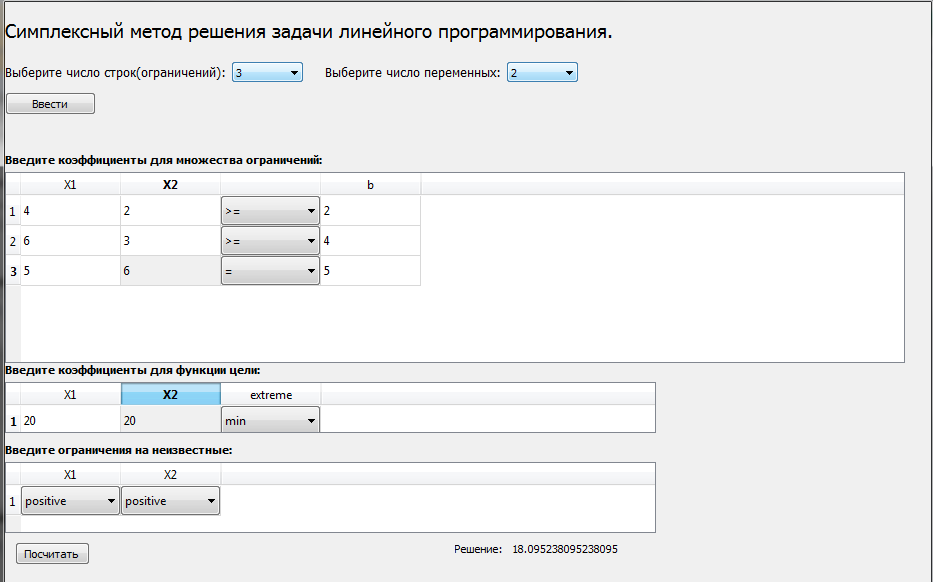
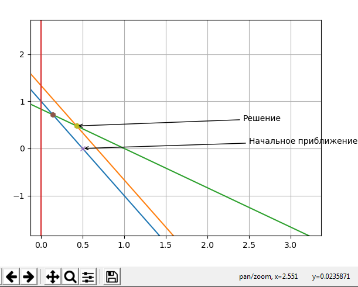

# Reference in English
This application is for solving the linear programming problem by the simplex method.
## Requirements
- Python 3.6-...
- packages indicated in `requirements.txt`
## Install, launch, uninstall
1. Create a copy of the repository: `https://github.com/Vladislav-Dmitriev/Solving-linear-programming-problems-by-the-simplex-method`
2. Go to the project folder - cd [path to the directory in which the project lies]/computer_technologies_simplex
3. Install the missing packages - pip install -r requirements.txt
4. Go to the src directory - cd src
4. Run the application - python main.py
## Work with the application
- First you need to select the number of lines (number of restrictions), the number of variables and press `Ввести`.
- Next, it is proposed to introduce coefficients for the set of constraints, for the objective function and restrictions on the unknown,  
 the `extreme` column is responsible for maximizing or minimizing your objective function.
- Further, if you entered the data correctly, click `Посчитать`.   If the input was incorrect (for example letter instead of number) -
  You will receive an error message about exactly where the wrong input was.
- With the correct data, you will receive a response.
- Also, if the dimension of the problem = 2, (two variables), then the application will suggest constructing a graph of iterations  
  when finding the optimal solution.
- Use the magnifier in the panel to enlarge the image.
- If the application reported an algorithm loop, then you will be asked to remove the restrictions on the variable - change to `any`
### Requirements for the task conditions
- Make sure your constraint matrix is full rank.

# Reference in Russian
Это приложение для решения задачи линейного программирования симплекс-методом.
## Требования
- Python 3.6-...
- пакеты, указанные в `requirements.txt`
## Установка, запуск, удаление
1. Cоздать копию репозитория: `https://github.com/Vladislav-Dmitriev/Solving-linear-programming-problems-by-the-simplex-method`
2. Перейти в папку проекта - cd [путь к директории в которой лежит проект]/computer_technologies_simplex
3. Установить недостающие пакеты - pip install -r requirements.txt
4. Перейти в диреторию src - cd src
4. Запустить приложение - python main.py
## Работа с приложением
- Сперва нужно выбрать число строк(число ограничений), число переменных и нажать `Ввести`.
- Далее предлагается ввести коэффициенты для множества ограничений, для функции цели и ограничения на неизвестные, 
 колонка `extreme` отвечает за максимизацию или минимизацию вашей целевой функции.
- Далее, если вы ввели данные корректно, нажмите `Посчитать`.  В случае, если ввод был некорректным(например буква вместо числа) -
  вы получите сообщение об ошибке и о том где именно был неправильный ввод.
- При корректных данных вы получите ответ.
- Также, если размерность задачи = 2, (две переменные) то приложение предложит построить график итераций 
  при нахождении оптимального решения.
- Для увеличения изображения используйте лупу в панели.
- Если приложение сообщило о зацикливании алгоритма, то вам будет предложено снять ограничения на переменную - поменять на `any`
### Требования к условиям задачи
- Убедитесь что ваша матрица ограничений - полного ранга.
### Пример
#### Следующая задача была взята как пример.
 
#### Тут можно увидеть начальное приближение а также 2 опорных решения, расположенных на многограннике ограничений.

